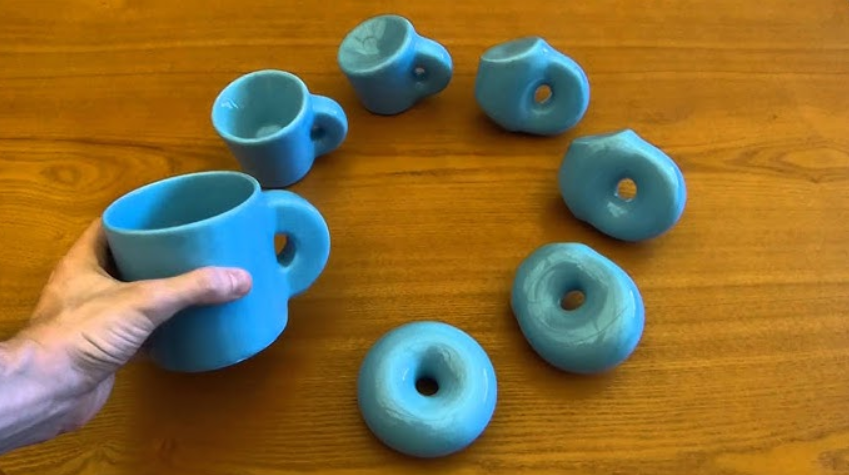
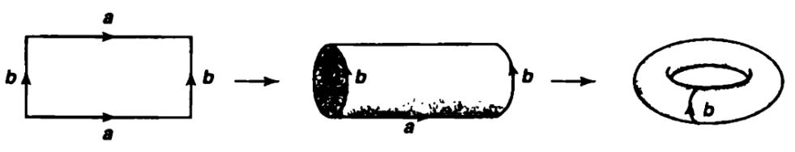
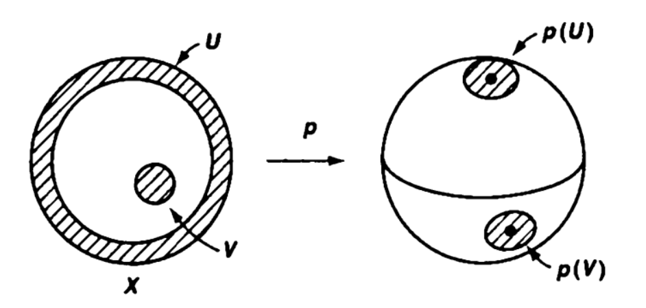
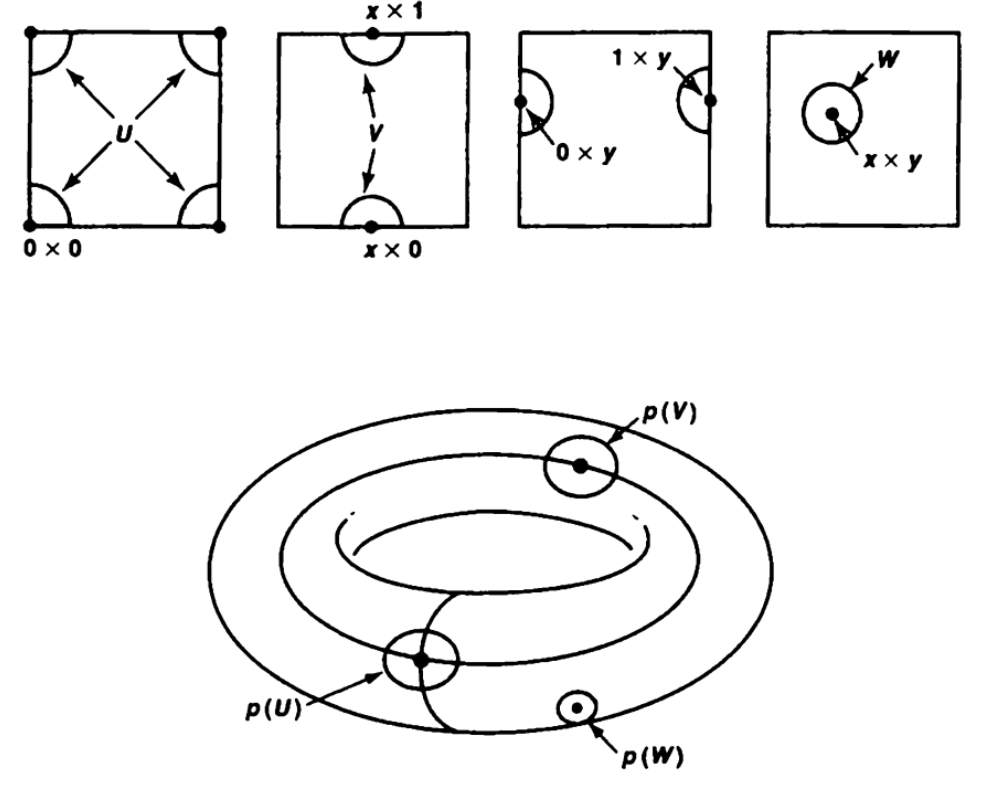

## Definition 1
Let $X$ and $Y$ be topological spaces, and let $p: X \to Y$ be a surjective map. The map $p$ is said to be a ***quotient map*** if 

$$U \text{ is open in } Y \iff p^{-1}(U) \text{ is open in } X.$$

[연속함수](../Continuous_Function/index.qmd#sec-definition)가 $(\Longrightarrow)$ 방향에 대해서만 정의되는 반면, quotient map은 양방향 모두 성립하면서 surjective인 함수로 정의된다. 

## Remark 1
**(i)** Every quotient map is continuous.

**(ii)** Every homeomorphism is a quotient map. However, the converse does not hold. That is, there is a quotient map that is not a homeomorphism.

**(iii)** An equivalent condition is to require that 

$$C \text{ is closed in } Y \iff p^{-1}(C) \text{ is closed in } X.$$

**(iv)** Every surjective, continuous, open (or closed) map is a quotient map. However, the converse does not hold. In particular, there is a quotient map that is not an open map.

$\big[(\because)$ We consider $\pi_1: \mathbb{R} \times \mathbb{R} \to \mathbb{R}$. Since $\pi_1$ is a surjective, continuous, and open map, it is a quotient map. 

Let $A = \{ (x, y) \in \mathbb{R} \times \mathbb{R} \mid x \ge 0 \text{ or } y = 0 \}.$ Note that 

$$A = ([0, \infty) \times \mathbb{R}) \cup (\mathbb{R} \times \{ 0 \}).$$

Since $[0, \infty), \{ 0 \}$ and $\mathbb{R}$ are closed in $\mathbb{R},$ $A$ is closed in $\mathbb{R} \times \mathbb{R}.$

Clearly, the map $q := \pi_1 \vert_A : A \to \mathbb{R}$ is surjective and continuous. Let $f: \mathbb{R} \to A$ be a map defined by $f(x) = (x, 0), \forall x \in \mathbb{R}.$ Then $f$ is well-defined and continuous.

Note that 

$$\begin{align*}
    (q \circ f)(x) &= q(f(x)) \\
    &= q(x, 0) \\
    &= x,
\end{align*}$$ 

for all $x \in \mathbb{R},$ which means that the map $q \circ f = \mathrm{id}_{\mathbb{R}}.$ By Exercise 22.2 (a), $p$ is a quotient map.

However, it is not an open map. To see this, consider 

$$B := A \cap \{ (x, y) \in \mathbb{R} \times \mathbb{R} \mid x^2 + (y- 2)^2 < 1 \}.$$

Note that $B$ is open in $A,$ but $q(B) = [0, 1)$, which is not open in $\mathbb{R}$. Thus, $q$ is not an open map.

Furthermore, it is also not a closed map. Consider 

$$D := A \cap \{ (x, y) \in \mathbb{R} \times \mathbb{R} \mid xy = 1. \}$$

Note that $D$ is closed in $A,$ but $q(D) = (0, \infty),$ which is not closed in $\mathbb{R}.$ Thus, $q$ is not a closed map.$\big]$

## Theorem 1
Let $X$ be a topological space and let $A$ be a set. Let $p: X \to A$ be a surjective map. Then the collection 

$$\mathscr{T}_p = \{  U \subset A \mid p^{-1}(U) \text{ is open in } X \}$$

forms a topology on $A$. We call this ***the quotient topology on $A$ induced by $p$.***

정의에서는 $A$에 어떠한 topology도 주지 않았었고, 당연히 $p$도 quotient map이라는 말을 하지 않았다. 그런데 $\mathscr{T}_p$와 같이 컬렉션을 주면 이는 $A$에서의 topology가 되고, 그제서야 비로소 $p$도 quotient map이 된다. 사실 정의를 보면 $p$가 반드시 quotient map이 되도록 topology를 만든 것에 불과하다.

### Proof
Since $p^{-1}(\emptyset) = \emptyset$ and it is open in $X$, $\emptyset \in \mathscr{T}_p.$ Since $p^{-1}(A) = X$ and it is open in $X$, $X \in \mathscr{T}_p.$

Let $\{ U_\alpha \}$ be a collection of elements of $\mathscr{T}_p.$ Then 

$$\begin{align*}
p^{-1}\left( \bigcup U_\alpha \right) &= \bigcup p^{-1}(U_\alpha)
\end{align*}$$

is open in $X$ because each $p^{-1}(U_\alpha)$ is open in $X$. 

Let $\{ U_i \}_{i=1}^n$ be a finite collection of elements of $\mathscr{T}_p$. Then 

$$\begin{align*}
p^{-1}\left( \bigcap_{i=1}^n U_i \right) &= \bigcap_{i=1}^n p^{-1}(U_i)
\end{align*}$$

is open in $X$ because each $p^{-1}(U_\alpha)$ is open in $X$. 

Hence $\mathscr{T}_p$ forms a topology on $A$. $\blacksquare$

## Definition 2
Let $X$ be a topological space, and let $\sim$ be an equivalence relation of $X$. Let $p: X \to X / \sim$ be the canonical projection, that is, $p(x) = [x], \forall x \in X$, where $[x]$ is the equivalence class of $x$. Then the topological space $(X/\sim, \mathscr{T}_p)$ is called a ***quotient space*** of $X$. 

## Remark 2
With a quotient topology, subspaces, products of maps, and $T_2$ condition do not behave well.

**(i)** If $p : X \to Y$ is a quotient map and $A$ is a subspace of $X$, then the map $q: A \to p(A)$ obtained by restricting $p$ need NOT be a quotient map.

$\big[(\because)$ Let $X = [0, 1]$ and $Y = S^1.$ Let $p: X \to Y$ be a map defined by $p(t) = (\cos 2\pi t, \sin 2\pi t), \forall t \in [0, 1].$ 

Let $A = [0, 1),$ and let $q:A \to p(A) = S^1$ be the restriction of $p$ onto $A.$ Let 

$$U = \{ (\cos 2\pi t, \sin 2 \pi t) \in \mathbb{R}^2 \mid 0 \le t < \frac{1}{2} \} \subset S^1.$$

Then $q^{-1}(U) = [0, \frac{1}{2})$ is open in $A.$ However, $U$ is not open in $S^1$ because $(1, 0) \in U$ but any open set containing $(1, 0)$ is not contained in $U.$ Thus, $q$ is not a quotient map.$\big]$

**(ii)** The product of two quotient maps need NOT be a quotient map.

$\big[(\because)$ 

$\big]$

**(iii)** If $X$ is $T_2$, then $X/\sim$ need NOT be $T_2.$ 

$\big[(\because)$ Let $X = [0, 1] \times \{ 0, 1 \},$ and let define the relation $\sim$ on $X$ by 

$$(x_1, y_1) \sim (x_2, y_2) \iff \begin{cases}
(x_1, y_1) = (x_2, y_2) \\
x_1 = x_2 > 0, \vert y_1 - y_2 \vert = 1.
\end{cases}$$

Then $\sim$ is an equivalence relation on $X.$ Let $p: X \to X/\sim$ be the canonical surjection. We give $X/\sim$ the quotient topology, so $p$ is a quotient map.

Note that $X$ is clearly $T_2.$ Let $\{ (0, 0) \}, \{ (0, 1) \} \in X/\sim.$ Suppose that $X/\sim$ is $T_2.$ Then there exists open sets $U, V$ in $X/\sim$ such that $\{ (0, 0) \} \in U, \{ (0, 1) \} \in V$ and $U \cap V = \emptyset.$ 

Since $p^{-1}(U)$ and $p^{-1}(V)$ are open in $X,$ there must exist $\varepsilon_1, \varepsilon_2 > 0$ such that $[0, \varepsilon_1) \times \{ 0 \} \subset p^{-1}(U)$ and $[0, \varepsilon_2) \times \{ 1 \} \subset p^{-1}(V).$ Take $\varepsilon = \min \{ \varepsilon_1, \varepsilon_2 \}.$ Then we must obtain that $(x, 0) \in p^{-1}(U)$ and $(x, 1) \in p^{-1}(V)$ for some $0 < x < \varepsilon.$ Then $p(x, 0) \in U$ and $p(x, 1) \in V.$ Since $p(x, 0) = p(x, 1),$ $U \cap V \neq \emptyset. \bigotimes.$

Thus, $X/\sim$ is not $T_2.$$\big]$

## Lemma 
Let $p: X \to Y$ and $q: Y \to Z$ be quotient maps. Then the composition map $q \circ p : X \to Z$ is also a quotient map.

### Proof
Since $p$ and $q$ are quotient maps, so are surjective, the composition $q \circ p$ is also surjective.

Let $V$ be an open subset of $Z.$ Then $q^{-1}(V)$ is open in $Y$, and so $p^{-1}(q^{-1}(V))$ is open in $X.$ Since $p^{-1}(q^{-1}(V)) = (q \circ p)^{-1}(V)$ and is open in $X$, the one direction to be a quotient map is satisfied.

For $U \subset Z$, suppose that $(q \circ p)^{-1}(U)$ is open in $X$. Since $(q \circ p)^{-1}(U) = p^{-1}(q^{-1}(U))$ and is open in $X,$ $q^{-1}(U)$ is open in $Y.$ It follows that $U$ is open in $Z$. Thus, the composition $q \circ p$ is a quotient map. $\blacksquare$

## Theorem 2
Let $p: X \to Y$ be a quotient map, and let $g: X \to Z$ be a map that is constant on $p^{-1}( \{ y \})$ for each $y \in Y$. Then followings hold:

**(i)** There exists a map $f: Y \to Z$ such that $f \circ p = g.$

**(ii)** $f$ is continuous $\iff$ $g$ is continuous.

**(iii)** $f$ is a quotient map $\iff$ $g$ is a quotient map.

위와 같이 주어진 함수 $p$와 $g$를 가지고 $Y$에서 $Z$로 가는 함수 $f$를 자연스럽게 만들 수 있는데, 그러기 위해서는 $g$에 붙은 조건이 반드시 필요하다. 함수를 만들기 위해서는 $Y$의 모든 원소들이 $Z$로 유일하게 매핑되어야 하는데, 우리는 $p$에 의한 $y$의 preimage에 속하는 원소들이 $g$에 의해서 갖는 $Z$에서의 값을 $f$로 주려고 한다. 그런데 일반적으로 $y$의 preimage는 여러 원소를 가질 수 있고, 이 각각의 원소들이 $g$에 의해서 서로 다른 값들로 매핑된다고 하면 $f$의 값으로 뭘 주어야 할지 경우의 수가 생긴다. 다르게 말하면 자연스럽게 $f$를 정의할 수 없다는 뜻이므로, 이를 방지하고자 각 preimage에서는 $g$가 오직 하나의 값만을 가진다고, 즉 상수함수라고 가정하는 것이다. 

### Proof
**(i)** We define a map $f: Y \to Z$ by $f(y) = g(x)$ for some $x \in p^{-1}(\\{ y\\})$, for each $y \in Y.$ 

To see the well-definedness of $f$, let $y_1, y_2 \in Y.$ Suppose that $y_1 = y_2.$ Since $p$ is a quotient map, we can take some elements $x_1 \in p^{-1}(\{ y_1 \})$ and $x_2 \in p^{-1}(\{ y_2 \}).$ Since $g$ has constant values on $p^{-1}( \{ y_1 \})$ and $p^{-1}( \{ y_2 \})$, respectively, we have that $g(x) = g(x_1), \forall x \in p^{-1}( \{ y_1 \})$ and $g(x) = g(x_2), \forall x \in p^{-1}( \{ y_2 \}).$ Since $y_1 = y_2$, $g(x_1) = g(x_2)$, so $f(y_1) = f(y_2).$ Thus, $f$ is well-defined.

Let $x \in X.$ Then $x \in p^{-1}(\{y\})$ for some $y \in Y$, and we have 

$$\begin{align*}
(f \circ p)(x) &= f(p(x)) \\
&= f(y) \\
&= g(x).
\end{align*}$$

Thus, $f \circ p = g.$ 

**(ii)** 

$(\Longrightarrow)$

Suppose that $f$ is continuous. Since $p$ is a quotient map, so is continuous and $f \circ p = g$, we conclude that $g$ is also continuous.

$(\Longleftarrow)$

Suppose that $g$ is continuous. Let $V$ be an open subset of $Z$. Since $g$ is continuous, $g^{-1}(V)$ is open in $X$. Note that $g^{-1}(V) = p^{-1}(f^{-1}(V)).$ Since $p$ is a quotient map and $p^{-1}(f^{-1}(V)) = g^{-1}(V)$ is open in $X$, $f^{-1}(V)$ is open in $Y$, which means that $f$ is continuous. 

**(iii)** 

$(\Longrightarrow)$

Suppose that $f$ is a quotient map. By preceeding lemma, $g = f \circ p$ is a quotient map.

$(\Longleftarrow)$

Suppose that $g$ is a quotient map. 

To verify that $f$ is a quotient map, let $V$ be an open subset of $Z$. Since $g$ is a quotient map, $g^{-1}(V)$ is open in $X$. Since $g^{-1}(V) = p^{-1}(f^{-1}(V))$ and $p$ is a quotient map, $f^{-1}(V)$ is open in $Y$.

Conversely, for $U \subset Z$, we suppose that $f^{-1}(U)$ is open in $Y.$ Then $g^{-1}(U) = p^{-1}(f^{-1}(U))$ is open in $X$, which means that $U$ is open in $Z$. Thus, $f$ is a quotient map. $\blacksquare$

## Corollary
Let $g: X \to Z$ be a surjective continuous map. Let 

$$X/\sim := \{ g^{-1}(\{z\}) \mid z \in Z \}.$$

Then $X/\sim$ is a partition of $X$. Let $\sim$ be the equivalence relation on $X$ induced by the partition $X/\sim$, and let $p: X \to X/\sim$ be the canonical projection. We assign $X/\sim$ the quotient topology. Then followings hold:

**(i)** There exists a bijective continuous map $f: X/\sim \to Z$ such that $f \circ p = g.$

**(ii)** $f$ is a homeomorphism $\iff$ $g$ is a quotient map.

**(iii)** If $Z$ is Hausdorff, then $X/\sim$ is also Hausdorff.

Theorem 2는 사실상 이 Corollary를 보이기 위한 보조정리에 불과하다고 봐도 무방하다. 

$X$를 우리가 잘 알고 있는 위상 공간(예컨대 사각형 박스 $[0, 1]^2$)으로 가져오고, $Z$는 $X$를 적당히 잘 "주물러서" 만들 수 있는 공간(예컨대 구 $S^2$)이라고 하자. 이때 $X$에서 $Z$로 가는 surjective continuous function $g$를 찾아낼 수만 있다면, $g$를 가지고 $X$에 quotient topology를 줄 수 있고, 이 quotient topology와 $Z$는 위상동형이라는 게 정리의 결론이다. 

### Proof
First, we will show that $X/\sim$ is a partition of $X$. Since $g$ is surjective, each $g^{-1}(\{z\})$ is nonempty. 

Since each $g^{-1}(\{z\}) \subset X,$ we have 

$$\bigcup_{z \in Z} g^{-1}(\{z\}) \subset X.$$

Let $x \in X$. Then $x \in g^{-1}(\{z\})$ for some $z \in Z$, which implies that 

$$X \subset \bigcup_{z \in Z} g^{-1}(\{z\}).$$

Thus, $X/\sim$ covers $X$. 

Let $g^{-1}(\{z_1\}), g^{-1}(\{z_2\}) \in X/\sim$ with $g^{-1}(\{z_1\}) \neq g^{-1}(\{z_2\}).$ If $x \in g^{-1}(\{z_1\}) \cap g^{-1}(\{z_2\}),$ then $z_1 = g(x) = z_2$, which means that $g^{-1}(\{z_1\}) = g^{-1}(\{z_2\}).$ Thus, we must obtain $g^{-1}(\{z_1\}) \cap g^{-1}(\{z_2\}) = \emptyset.$ Hence, $X/\sim$ is a partition of $X.$ 

**(i)** Let $x \in X.$ Then $x \in g^{-1}(\{ z \})$ for some $z \in Z.$ Then $p(x) = g^{-1}(\{z\})$, so $p^{-1}(\{ g^{-1}(\{z\}) \}) = g^{-1}(\{z\}).$ Thus, $g$ has the constant value $z$ on each set $p^{-1}(\{ g^{-1}(\{z\}) \}) = g^{-1}(\{z\}).$ By Theorem 2 (i), there exists a map $f: X/\sim \to Z$ such that $f \circ p = g.$ Since $g$ is continuous, by Theorem 2 (ii), $f$ is also continuous. 

Suppose that $f(g^{-1}(\{z_1\})) = f(g^{-1}(\{z_2\}))$ for some $z_1, z_2 \in Z$. Then $p(x_1) = g^{-1}(\{z_1\})$ and $p(x_2) = g^{-1}(\{z_2\})$ for some $x_1, x_2 \in X,$ which implies that $x_1 \in g^{-1}(\{z_1\})$ and $x_2 \in g^{-1}(\{z_2\}).$ Then $g(x_1) = z_1$ and $g(x_2) = z_2$. Since $f \circ p = g$, we have that 

$$z_1 = g(x_1) = f(p(x_1)) = f(p(x_2)) = g(x_2) = z_2,$$

which implies that $g^{-1}(\{z_1\}) = g^{-1}(\{z_2\}).$ Thus, $f$ is injective.

Let $z \in Z.$ Since $g$ is surjective, $z = g(x)$ for some $x \in X$. Then $x \in g^{-1}(\{z\}),$ so that $p(x) = g^{-1}(\{z\}).$ Then we have $f(p(x)) = g(x) = z$, which means that $f$ is surjective. Hence, $f$ is bijective. 

**(ii)** 

$(\Longrightarrow)$

Suppose that $f$ is a homeomorphism. Since $g$ is surjective and continuous, we need to show that if $g^{-1}(V)$ is open in $X$ for $V \subset Z,$ then $V$ is open in $Z$.

To verify this, for $V \subset Z$, we suppose that $g^{-1}(V)$ is open in $X$. Since $g^{-1}(V) = p^{-1}(f^{-1}(V))$ and $p$ is a quotient map, $f^{-1}(V)$ is open in $X/\sim.$ Since $f$ is a homeomorphism, $V = f(f^{-1}(V))$ is open in $Z.$ Thus, $g$ is a quotient map.

$(\Longleftarrow)$

Suppose that $g$ is a quotient map. By Theorem 2 (iii), $f$ is also a quotient map. We will show that if $U$ is open in $X/\sim$, then $f(U)$ is open in $Z$. If it holds, then the inverse function $f^{-1}: Z \to X/\sim$ of $f$ is continuous, so that $f$ is a homeomorphism.

To see this, let $U$ be an open set of $X/\sim.$ Since $U = f^{-1}(f(U))$ is open in $X/\sim$ and $f$ is a quotient map, $f(U)$ is open in $Z$. It completes the proof. $\blacksquare$

## Example
이쯤 왔으면 도대체 quotient map이니, quotient topology, space라는 걸 왜 다루는지 의문을 가지는 게 당연하다. 결론부터 말하자면 quotient space는 기존에 있었던 topology를 "cut-and-paste"하는, 즉 "자르고 이어붙인" 위상공간에 해당한다.

위상수학이라는 학문은 대중적으로 "커피잔과 도넛이 같다"라는 재미난 사실을 다루는 분야로 알려져 있는 듯하다. 어떻게 커피잔과 도넛이 같은고 하니, 커피잔을 적당히 잘 "주물러서" 컵 손잡이 부분을 늘리고 잔 내부를 채워서 도넛으로 만들 수 있다는 것이다. 

비슷한 방법으로 직사각형 모양의 종이를 잘 "주물러서" 토러스 모양으로 만들 수 있다. 아래 사진에서 각 $a$ 선분을 이어붙여서 원통 모양으로 만들고, 원통의 양 끝을 이어붙이면 토러스가 된다. 

직관적으로 이해는 될텐데, 수식으로 써보라고 하면 막막하다. 이때 강력한 도구가 되는게 바로 quotient space다.

**(i)** 간단한 예부터 시작해보자. $X = D^2 = \{ (x, y) \in \mathbb{R}^2 \mid x^2 + y^2 \le 1 \}$과 같이 closed disk를 하나 들고오고, $X$ 위에서의 동치 관계 $\sim$을 다음과 같이 정의하자. 

$$\begin{align*}
&(x_1, y_1) \sim (x_2, y_2), \text{ if } (x_1, y_1) = (x_2, y_2) \text{ or } (x_1, y_1), (x_2, y_2) \in \partial X
\end{align*}$$

그러니까 경계에 있는 점들은 모두 관계가 있다고 보고, 그 외 다른 점들은 자기 자신과 관계가 있도록 두는 것이다. 이렇게 정의하면 경계점들은 마치 어떤 한 점으로 수축되는 듯한 효과를 주게 된다. 그러면 $X$를 quotient map $p$로 매핑한 이미지를 생각해보면, 자연스럽게(?) $X$는 sphere $S^2 = \{ (x, y, z) \in \mathbb{R}^2 \mid x^2 + y^2 + z^2 = 1 \}$로 옮겨진다는 사실을 알 수 있다. 정확하게는 quotient space $X/\sim$은 $S^2$와 homeomorphic하다. 

**(ii)** 두 번째로 직사각형과 토러스를 다뤄보자. $X = [0, 1] \times [0, 1]$로 가져오고, $X$ 위에서의 동치 관계 $\sim$을 다음과 같이 정의하자. 

$$\begin{align*}
&(x_1, y_1) \sim (x_2, y_2), \text{ if } x_1 - y_1 \in \mathbb{Z} \text{ and } y_1 - y_2 \in \mathbb{Z}
\end{align*}$$

러프하게 말해서 $x, y \in [0, 1]$에 대해서 $(x, 0) \sim (x, 1)$이고, $(0, y) \sim (1, y)$으로 두고, 그 외 다른 점들은 자기 자신과 관계가 있다고 두는 것이다. 그러면 직관적으로(?) 위아래 선분이 평행하게 딱 들어맞고, 좌우의 선분 또한 딱 들어맞게 바뀌는 효과가 되고, $X$는 $p$에 의해 토러스로 매핑된다. 정확하게는 $X/\sim$은 토러스와 homeomorphic하다. 

# Reference
- James R. Munkres. (2000). Topology (2nd ed.). Pearson.