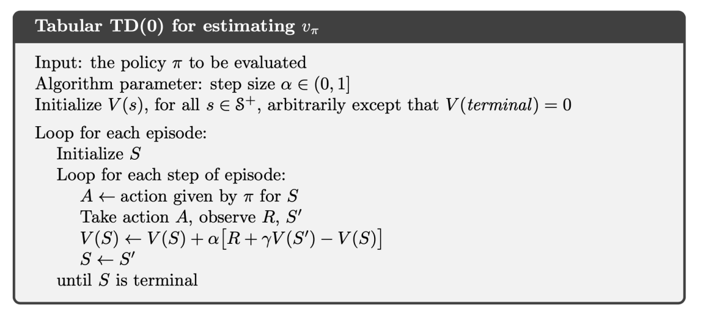
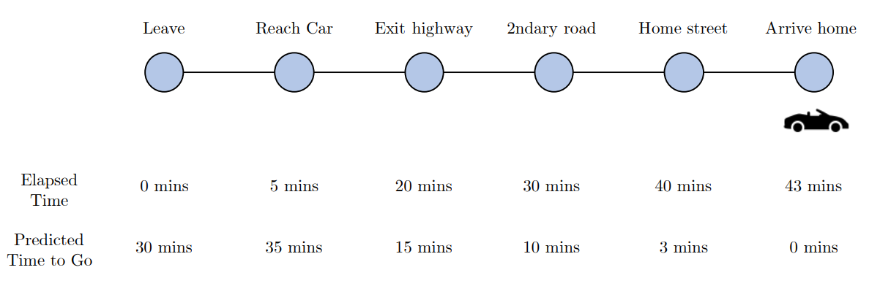
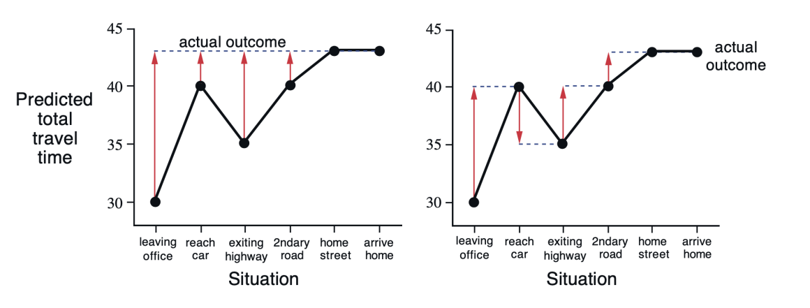
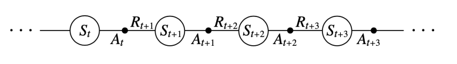
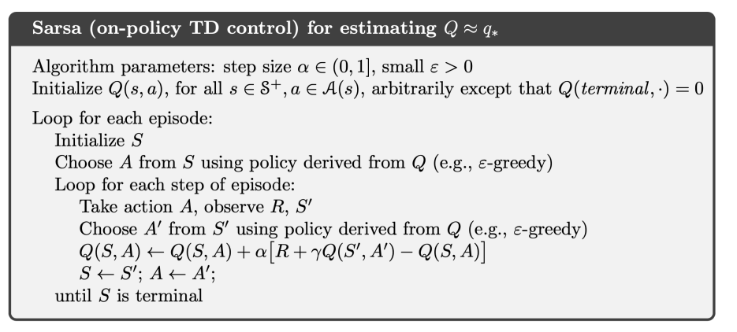
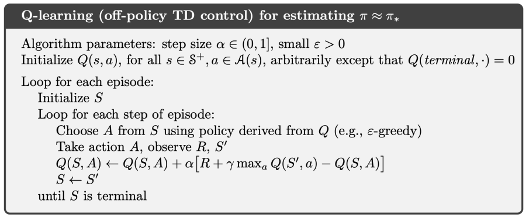
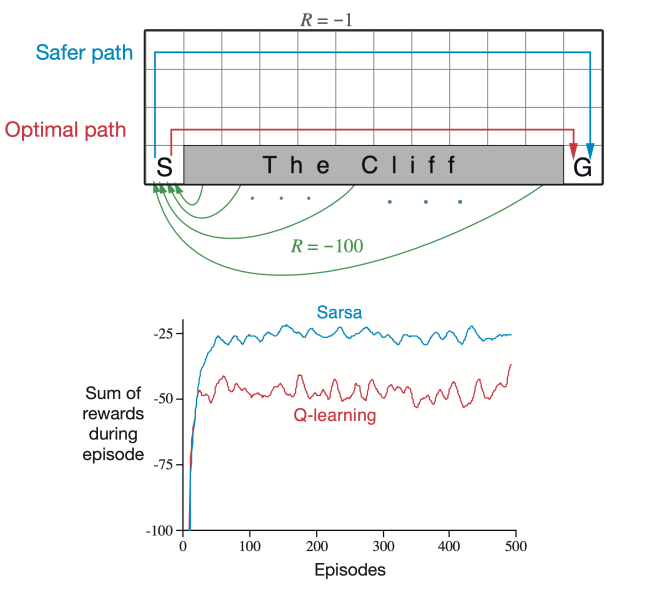
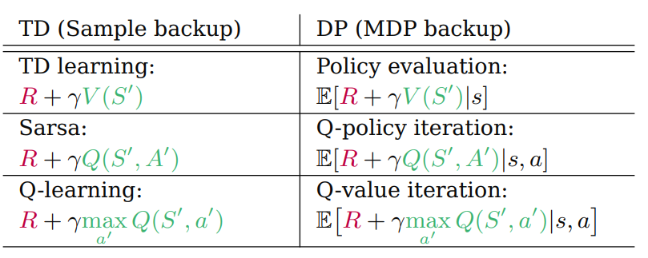

# Temporal-Difference Learning
Temporal-difference learning, 줄여서 TD learning은 몬테카를로 방법과 마찬가지로 dynamics function $p$를 모르는 model-free 문제를 해결하기 위해 주체의 경험을 토대로 value function을 업데이트하여 DP와 동일한 효과를 내는 것을 목표로 하는 방법이다. 

특별히 TD는 MC와 DP의 방법을 섞어서 만들어진 방법이라고도 할 수 있다. TD는 주체의 경험으로부터 학습하는 MC의 방법과, 주변 값들을 이용하여 가치 함수를 업데이트하는 DP의 bootstrap을 모두 사용한다. 

## Prediction
MC의 업데이트 룰은 다음과 같았다.

$$V(S_t) \longleftarrow V(S_t) + \alpha_t\left[ G_t - V(S_t) \right]$$

한번 $V$를 업데이트하려면 일단 $G_t$가 계산이 되어야 하는데, 이는 하나의 에피소드가 끝날 때까지 기다려야 한다는 말이다. 즉 기본적으로 prediction 과정이 오래 걸리게 된다.

반면 TD의 업데이트 룰은 다음과 같다.

$$V(S_t) \longleftarrow V(S_t) + \alpha_t\left[ R_{t+1} + \gamma V(S_{t+1}) - V(S_t) \right]$$

$V$를 업데이트하기 위해 기다려야 하는 시간이 1 step으로 줄어든 것을 확인할 수 있다. 즉 MC의 타겟이 $G_t$인 반면, TD의 타겟은 $R_{t+1} + \gamma V(S_{t+1})$이다. 이와 같은 업데이트 룰은 다음의 식으로부터 나오게 된다.

$$\begin{aligned}
v_\pi(s) &:= \mathbb{E}_\pi[G_t \mid S_t = s] \\
&= \mathbb{E}_\pi[R_{t+1} + \gamma R_{t+2} + \gamma^2 R_{t+3} + \dots \mid S_t = s] \\
&= \mathbb{E}_\pi[R_{t+1} + \gamma G_{t+1} \mid S_t = s] \\
&= \mathbb{E}_\pi[R_{t+1} + \gamma v_\pi(S_{t+1}) \mid S_t = s]
\end{aligned}$$

기본적으로 $v_\pi(s)$의 값, 즉 기댓값을 계산하려면 확률변수의 분포를 알아야 한다. 다시 말해 여기서는 dynamics function $p$를 알아야 하는데 그러지 못하니, 기댓값을 사용하지 말고 그냥 기댓값 연산자 내부의 $R_{t+1} + \gamma v_\pi(S_{t+1})$를 사용하면서 근사해 나가자는 것이다. 3번째 줄에서 4번째 줄로 넘어갈 때 $G_{t+1} = v_\pi(S_{t+1})$로 사용된 것도 이러한 맥락이 담겨 있다. 물론 MC도 이 수식에서 나왔지만, TD는 bootstrap을 한다는 점에서 MC와 차이가 있다. 이렇게 prediction을 하는 과정을 특별히 TD(0)라고 부른다.

### TD(0) Pseudocode for Prediction

### MC vs TD Updates

이번엔 구체적으로 MC와 TD 업데이트에 어떤 차이가 있는지 살펴보자. 위 사진은 연구실에서 퇴근하기 위해 차를 끌고 도로를 통과해 집으로 도착하기까지의 걸린 시간과 각 지점에서 도착까지 얼마나 걸리는지 예측한 시간을 나타낸 것이다. 예를 들어 연구실에서 막 퇴근할 때 도착 예상 시간이 30분 걸린다고 측정했지만, 차를 끌고 막상 도로에 나가보니 차가 막히기도 하고 여러 사정에 의해서 실제로는 30분보다 늘어날 수도 있고 줄어들 수도 있을 것이다. 그리고 마침내 집에 도착할 때에는 43분이 걸린 상황이다. 아래 그래프는 각 상황별로 도착 예상 시간을 나타낸 것이다. 왼쪽은 MC의 업데이트, 오른쪽은 TD의 업데이트를 나타낸다.

MC의 경우 업데이트가 한 에피소드가 끝날 때에서야 이뤄지므로 오차가 크지만, TD는 상황이 끝날 때마다 업데이트가 이뤄지므로 MC의 비해서는 작다. 즉, TD는 MC에 비해 상대적으로 작은 분산을 가진다. 반면 TD는 bootstrap을 하기 때문에 MC에 비해서 값이 편향될 가능성이 높다.

## Control
한편, 우리는 여전히 dynamics function $p$를 모르므로 value function $v$을 가지고 직접 계산할 수는 없다. 때문에 action-value function $q$를 사용해 업데이트를 하는데, 이때 action을 on-policy 혹은 off-policy로 어떻게 선택하여 학습하는지에 따라 크게 SARSA, 혹은 Q-learning등의 방법들로 갈리게 된다.

### SARSA
SARSA는 대표적인 on-policy 방법으로, 타겟을 계산할 때 현재 사용하는 정책을 그대로 들고와서 action-value function을 개선한다는 점에서 on-policy 방법으로 분류된다. SARSA라는 이름은 다음과 같은 순서쌍에서 유래되었다.

SARSA의 업데이트 룰은 다음과 같다.

$$Q(S_t, A_t) \longleftarrow Q(S_t, A_t) + \alpha_t \left[ R_{t+1} + \gamma Q(S_{t+1}, A_{t+1}) - Q(S_t, A_t) \right]$$

### SARSA Pseudocode

### $\varepsilon$-Greedy
특별히 위 코드에서는 prediction과 control이 동시에 이루어지고 있는데, 구체적으로 $\varepsilon$-greedy 방법을 사용해 정책을 개선시킨다. $\varepsilon$-greedy란 $\varepsilon$의 확률로 random action을 선택하고, $1 - \varepsilon$의 확률로 현재 정책에 따라서 action을 선택하는 방법이다. 왜 $\varepsilon$만큼의 "오차"를 섞어서 행동을 선택하는걸까?

구체적으로 위 코드에서 행동은 단순히 랜덤하게 선택되는 것이 아니라, $Q$ 함수의 값을 최대화하는 그러한 행동으로 선택된다. 즉 

$$A = \arg \max_{a} Q(S,a)$$

로 주어진다. 다시 말해 행동을 그리디하게 선택하겠다는 의미이다. 그런데 이런 방식으로 계속 행동을 선택하는 게 반드시 최적의 정책일 필요는 없고, 따라서 어떤 경우에는 실제로 최적이 아닌 행동을 선택하게 될 수도 있다. 때문에 반드시 그리디한 방법만으로 행동을 선택하는 게 아니라, $\varepsilon$이라는 확률로 그리디한 방법이 아닌 다른 방법으로 랜덤하게 행동을 선택하도록 하는 오차를 끼워넣어주는 것이다. 즉 구체적으로 행동을 선택하는 단계에서 정책 $\pi$는 다음과 같은 방법으로 주어진다.

$$\pi(A\vert{}S) = \begin{cases}
(1 - \varepsilon) + \frac{\varepsilon}{\vert{}\mathcal{A}(S)\vert{}} & \text{if } A = \arg\max_{a} Q(S, a) \\ 
\frac{\varepsilon}{\vert{}\mathcal{A}(S)\vert{}} & \text{if } A \neq \arg\max_{a} Q(S, a) 
\end{cases}$$

이렇게 되면 당시의 상황 $S$에서 최대값을 주지 않는 행동이더라도 이론적으로는 모두 선택될 확률이 $0$보다는 크도록 존재하게 된다. 그러나 영원히 $\varepsilon > 0$인 상태로 학습하도록 두지는 않는데, 결국 뒤로 갈수록 최대값을 주지 않는 행동의 선택을 줄이고 그리디하게 선택하는 방법으로 학습을 진행하게 된다. 예를 들어 $\varepsilon_t = \frac{1}{t}$로 두면 이러한 조건을 만족시킨다. 이렇게 두면 정책 $\pi_t(a \mid s)$는 GLIE라고 불리는 다음의 조건을 만족하게 되고, 이는 SARSA 알고리즘이 최적의 value function $q_\ast$로 수렴하도록 하는 수학적 정당성을 마련해준다. 뒤이어서 소개할 Q-learning 역시 같은 조건을 만족하면 최적의 결과로 수렴하게 된다.

### GLIE
The following assumptions is called greedy in the limit of infinite exploration (GLIE):

**(i)** All state-action pairs are explored infinitely many times:

$$\lim_{t \to \infty} N_t(s,a) = \infty$$

**(ii)** The policy converges on a greedy policy:

$$\lim_{t \to \infty} \pi_t(a \mid s) = \mathbb{1} \left\{ a = \arg \max_{a'} Q_k(s,a') \right\}$$

## Theorem
Sarsa converges to the optimal action-value function, $Q(s, a) \to q_\ast(s, a)$, under the following conditions:

**(i)** $\pi_t(a \mid s)$ satisfies GLIE

**(ii)** Step-size $\alpha_t$ satisfies ***stochastic convergence equations***:

$$\sum_{t=1}^\infty \alpha_t = \infty \quad \text{and} \quad \sum_{t=1}^\infty \alpha_t^2 < \infty$$

### Q-Learning
다음으로 off-policy 방법인 Q-learning을 살펴보자. 위에서 보았듯이 on-policy 방법은 현재 사용하고 있는 정책을 그대로 들고와서 action-value function을 개선한다. 반면 off-policy 방법은 행동을 선택하는 정책과 action-value function을 개선하기 위한 정책을 분리하여 학습하는데, 행동을 선택할 때는 $\varepsilon$-greedy 방법을 사용하지만, action-value function을 개선할 때는 단순히 그리디하게 업데이트하여서 정책과는 무관하게 행동을 선택한다. 업데이트 룰은 다음과 같다. 

$$Q(S_t, A_t) \longleftarrow Q(S_t, A_t) + \alpha_t \left[ R_{t+1} + \gamma \max_{a} Q(S_{t+1}, a) - Q(S_t, A_t) \right]$$

### Q-Learning Psuedocode

### SARSA vs Q-Learning
다음으로 SARSA와 Q-learning을 비교해보자. 다음과 같은 cliff walking example을 살펴보자

S라는 출발점에서 격자들을 이동해 G라는 도착점으로 이동하는 모델이고, 한 칸 움직일 때마다 $-1$이라는 보상을 얻는다. 이때 맨 아래쪽에는 절벽이 있어서, 이 절벽으로 이동할 경우 $-100$의 보상을 얻게 된다. 이때 보상을 가장 적게 만드는 이동 경로가 우리가 원하는 최적의 정책이자 이동 경로일 것이다. SARSA와 Q-learning으로 대략 500번 정도 학습을 시켜보면 Q-learning이 실제로 최적의 경로를 찾아낸 반면, SARSA는 가능한 한 절벽으로부터 멀리 떨어져 있는 더욱 안전한 경로를 찾아낸 것을 알 수 있다. 반면 에피소드 동안의 보상을 살펴보면 SARSA가 Q-learning보다 더 좋은 성능을 내는 것을 알 수 있다. 이는 $\varepsilon$-greedy 때문에 최적의 경로를 찾아가는 Q-learning이 간혹 가다 절벽으로 떨어질 가능성을 만들어내기 때문이다. 

때문에 SARSA와 Q-learning에는 일종의 trade-off가 존재한다고 말할 수 있고, 내가 선택하는 문제와 목표에 따라서 선택해야 할 문제라고 할 수 있다. 

### Relationship Between TD and DP
한편 TD와 DP는 사실상 dynamics function $p$를 알고 있냐, 모르냐의 문제였다. 다시 말해 환경의 거동을 알고 있느냐, 모르냐에 따라서 사용할 수 있는 방법이 달라진다. 나아가 실제로 각 방법의 타겟을 보면 큰 차이가 없음을 확인할 수 있다.

# Reference 
- Richard S. Sutton, Andrew G. Barto. (2020). Reinforcement Learning : An Introduction (2nd ed.). MIT press.