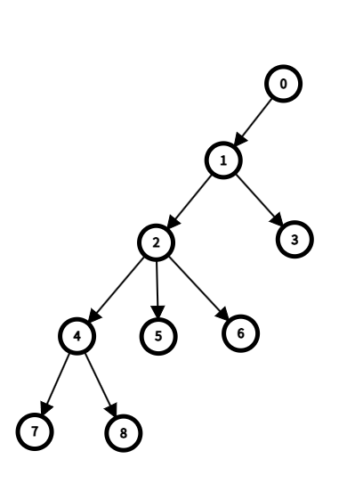

# Tree Isomorphism
$n$개의 vertex를 가지는 두 그래프 $G, G'$이 있다고 하자. 이때 두 그래프가 isomorphic한지 결정하는 문제는 보통 매우 어려운 일이다. 정확히는, 꽤나 큰 시간 복잡도를 요구하는 문제이다. 가장 최악의 경우 $\mathcal{O}(n!)$이 소요된다. 팩토리얼이라는 함수가 얼마나 급격하게 증가하는지를 생각해본다면, vertex의 개수가 그리 크지 않음에도 이 문제가 얼마나 복잡한지 짐작할 수 있을 것이다.

그러나 다행히도 tree라는 그래프의 특별한 한 종류에 대해서는 이 문제를 해결하는 일반적인 알고리즘이 알려져 있고, 팩토리얼이 아닌 선형 시간 내에 해결할 수 있다.

## Definition 1
**(i)** A ***rooted tree*** $(T, r)$ is a tree $T$ with a special vertex $r \in V(T)$, called the ***root***. If $\{ x, y \} \in E(T)$ is an edge and a vertex $x$ lies on the unique path from $y$ to the root $r$, we say that $x$ is the ***father*** of $y$ and $y$ is the ***child*** of $x$.

**(ii)** A ***planted tree*** $(T, r, \nu)$ is a rooted tree $(T, r)$ with the collection of linear orderings, one linear ordering for the set of children of each vertex. 

**(iii)** Two rooted trees $(T, r)$ and $(T', r')$ are called ***isomorphic*** if there exists an isomorphism $\phi: V(T) \to V(T')$ such that $\phi(r) = r'$.

**(iv)** Two planted trees $(T, r, \nu)$ and $(T', r', \nu')$ are called ***isomorphic*** if there exists a rooted tree isomorphism $\phi: V(T) \to V(T')$ such that for children $a, b$ of a vertex, $a \le_\nu b \iff \phi(a) \le_{\nu'} \phi(b)$.

즉 tree 중에서 root라는 특별한 vertex를 가지는 tree를 rooted tree라고 부르며, rooted tree에서 같은 부모를 가지는 vertex들 사이에 ordering을 준 rooted tree를 planted tree라고 부른다. 

## Definition 2
For each planted tree $(T, r, \nu)$ on $n$ verticies, we define the ***code*** $A(T) \in \{ 0, 1 \}^{2n}$ of the tree $T$ recursively as follows:

**(i)** If $v$ is a leaf of $T$, let $L_v = 01$.

**(ii)** For a vertex $v$ with children $a_1 \le_\nu a_2 \le_\nu \cdots \le_\nu a_k$ such that each $a_i$ has a label $L_{a_i}$, let $L_v = 0L_{a_1}L_{a_2}\cdots L_{a_k}1$.

**(iii)** $A(T) = L_r$. 

이제 우리는 모든 planted tree와 code 사이에 일대일 대응이 존재함을 보일 것이다. 그리고 rooted tree에 canonical한 방법으로 order를 주고, 각 tree에서 항상 root를 정할 수 있음을 보임으로써 모든 tree에 대해서 code를 유일하게 결정할 수 있음을 보일 수 있다. 이러한 방법으로 서로 다른 두 tree가 isomorphic한지 선형 시간 내에 결정할 수 있다.

## Remark
Each label has the same number of $0$s as $1$s and the same is not true of any nontrivial initial sublabel.

## Theorem 1
For planted trees $T$ and $T'$, $A(T) = A(T') \iff T \cong T'$, that is, a given code uniquely determines the planted tree up to isomorphisms.

### Proof
If $T \cong T'$, then clearly $A(T) = A(T')$. 

Conversely, we first proceed by induction on $n$, the number of vertices of $T$, to show that a given code $A(T)$ of the planted tree $T$ uniquely determines $T$ up to isomorphisms.

The basic case $n=1$ gives us that $A(T) = 01$ and $T$ is the planted tree with a single vertex.

Suppose that for a given code of length greater than $2$ and less than $2n$, it corresponds to a unique planted tree up to isomorphisms. Let $C$ be a code of length $2n$ of a planted tree $(T, r, \nu)$. Then $C$ must be written as $C = 0L_1 \cdots L_t 1$ where each $L_i$ is a code of a planted tree $T_i$ with a root $r_i$ and $t$ is the number of children of $r$. We claim that the decomposition $C = 0L_1 \cdots L_t 1$ is unique. 

$\big[(\because)$ Since each $L_i$ is a code of a planted tree, it has the same number of $0$s as $1$s, and the same is not true of any non-trivial initial sublabel of $L_i$. Therefore, if we read the inner sublabel $L_1 \cdots L_t$ from left to right, the first sublabel $L_1$ must terminate exactly at the first position $j$ such that the sublabel $s_1 \cdots s_j$ of $L_i$ has the same number of $0$s as $1$s. This uniquely determines $L_1$. Applying this argument repeatedly to the remaining sublabel uniquely determines $L_2, \dots, L_t$ in sequence. Thus, the decomposition $C = 0L_1 \cdots L_t 1$ is unique.$\big]$ 

By the inductive hypothesis, each $T_i$ is uniquely determined up to isomorphism by $L_i$. Suppose $T'$ is another planted tree with $A(T') = C$. By the unique decomposition proven above, $T'$ also has a root $r'$ with $t$ children, and the codes of its subtrees $T'_i$ are exactly $L_1, \dots, L_t$. Thus, by the inductive hypothesis, there exists a rooted tree isomorphism $\phi_i : V(T_i) \to V(T'_i)$ for each $i = 1, \dots, t$.We construct a mapping $\Phi : V(T) \to V(T')$ by setting $\Phi(r) = r'$ and $\Phi(v) = \phi_i(v)$ for all $v \in V(T_i)$. Since each $\phi_i$ is an isomorphism and we preserve the corresponding linear ordering of $\nu$ and $\nu'$ for the children, $\Phi$ perfectly preserves the adjacency, the roots, and the left-to-right orderings. Thus, $\Phi$ is a planted tree isomorphism between $(T, r, \nu)$ and $(T', r', \nu')$. Consequently, the code uniquely determines the planted tree up to isomorphisms. $\blacksquare$

## Algorithm
그렇다면 구체적으로 주어진 코드와 planted tree가 어떻게 대응되는지 그 방법을 살펴보자.

핵심은 $0$은 아래로, $1$은 위로 가는 edge를 나타낸다는 것이다. 백문이 불여일견이다.

$$0000101101011011 \quad \longleftrightarrow \quad \downarrow \downarrow \downarrow \downarrow \uparrow \downarrow \uparrow \uparrow \downarrow \uparrow \downarrow \uparrow \uparrow \downarrow \uparrow \uparrow$$

## Lexicographic Ordering
We define the ***lexicographic ordering*** $\le$ between two sequences $A = (a_1, a_2, \cdots, a_n)$ and $B = (b_1, b_2, \cdots, b_m)$ by $A \le B$ 

**(i)** if $a_i = b_i$ for each $i = 1, 2, \cdots, n$, 

**(ii)** if $a_i < b_i$ where $i$ is the min index with $a_i \neq b_i$,

**(iii)** $A$ is an initial segment of $B$. 

Planted tree는 같은 부모를 가지는 vertex들 사이에 순서 관계가 주어져 있지만, rooted tree는 그렇지 않다. 때문에 rooted tree에서 planted tree를 유도해서 코드를 찾으려면 순서 관계를 주어야 하고, 위에서 정의한 사전식 순서는 이렇게 순서를 주는 canonical한 방법이 된다. 이렇게 어떤 vertex $v$의 자식들 $v_1, v_2, ..., v_d$들 사이에 순서 관계 $v_1 \le v_2 \le \cdots \le v_d$를 주면 이 순서대로 $v$의 label을 $0L _{v_1}L _{v_2} \cdots L _{v_d}1$로 만들 수 있다. 

## Eccentricity and Center
Let $G$ be a graph, and let $v \in V(G)$. 

**(i)** We define the ***eccentricity*** of $v$ by 

$$\mathrm{ex}_G(v) = \max _{u \in V(G)} d_G(u, v).$$

**(ii)** We define the ***center*** of $G$ is the set $C(G)$ of verticies of $G$ with the minimum eccentricity. 

쉽게 말해 eccentricity란 어떤 고정된 정점으로부터 그래프가 얼마나 멀리 뻗어나가 있는지 측정하는 척도 정도로 생각할 수 있다. 거꾸로 생각하면, 이 값이 크면 클수록 그래프의 주변부에 정점이 위치해 있고, 이 값이 작으면 작을수록 그래프의 '중심'에 위치해 있다는 뜻이 된다. 따라서 자연스럽게 그래프의 center, 즉 중심은 가장 작은 eccentricity를 가지는 vertex들의 집합으로 정의된다.

Minimum이라는 말 때문에 $C(G)$는 항상 singleton일 것 같지만, 실제로 한 개만 있을 필요는 없고 여러 개 있을 수도 있다. 예를 들어 cycle $C_3$를 생각해보면 3개의 vertex 모두가 $C(G)$에 들어있다. 

다시 tree의 관점으로 돌아오면, 위에서 rooted tree로부터 planted tree를 유도하는 방법을 다뤘으니 이제는 tree로부터 rooted tree를 유도하는 방법만 안다면 진정한 의미에서 tree의 isomorphic relation을 체크하는 문제를 해결할 수 있게 된다. 

그러면 우리는 주어진 tree로부터 root라는 특별한 vertex를 정의해야 하는데, 아래 정리는 root를 $C(G)$에서 뽑아서 canonical하게 정의할 수 있음을 보장해준다.

## Theorem 2
For a tree $T$, the center $C(T)$ of $T$ consists of a single vertex, or two adjacent vertices.

### Proof
We proceed by induction on $n = \vert V(T) \vert$. 

만약 $C(T)$가 가질 수 있는 형태가 여러 가지였다면 꽤나 골치아팠겠지만, 다행히도 하나 아니면 두 개 밖에 없으니 두 가지 경우만 커버하면 된다. 

우선 하나 밖에 없을 경우 고르고 자시고 할 게 없다. 그냥 하나 밖에 없는 그 원소를 root로 택하면 된다.

다음으로 $C(G) = \{c, c' \}$으로 두 인접한 원소로 이루어지는 경우, 어찌됐든 둘 중에 하나를 택해야 한다. 이때 둘 중 아무거나 택했을 때 tree의 코드가 이 선택에 의존할 가능성이 생긴다. 때문에 하나를 선택하는 canonical한 방법을 찾아야 하는데, 위에서 정의한 사전식 순서가 그 방법을 준다. 

우선 트리에서 edge $\{ c, c' \}$를 제거하는데, 트리의 정의에 의해 트리는 두 개의 component로 분리된다. 이때 각 component는 $c$와 $c'$을 포함하는데, 각 component 또한 tree이므로 root를 $c$와 $c'$으로 선택하는 rooted tree로 간주하고 각 tree의 코드를 구한 뒤 사전식 순서로 비교해서 더 작은 쪽의 component의 root를 원래 트리의 root로 선택한다. 

따라서 우리는 tree에서 rooted tree를, rooted tree에서 planted tree를 유일하게 유도하고 planted tree에서 code를 유일하게 결정하는 방법을 모두 알아냈음으로, 모든 tree는 유일하게 code를 가짐을 알아냈다. 이로써 코드를 이용해서 두 tree의 isomorphic relation을 결정할 수 있다. 

# Reference
- Matousek, J., & Nesetril, J. (2008). Invitation to Discrete Mathematics. Oxford University Press.