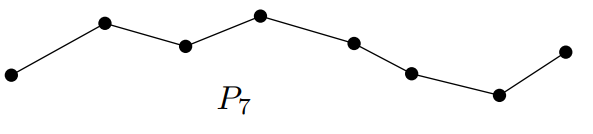

## Definition
Let $G$ be a graph, and let $v_1, v_2, ..., v_n \in V(G)$.

**(i)** The ***$n$-path*** $P_n$ of length $n$ is defined by 

$$V(P_n) = \{ 0 \} \cup [n] \quad \text{and} \quad E(P_n) = \{\{ i-1, i \} \mid i \in [n] \}.$$

**(ii)** A ***path*** of length $\ell$ in $G$ is a subgraph that is isomorphic to $P_\ell$. It is a sequence of **distinct** vertices $v_0, v_1, ..., v_\ell$ of $G$ such that $\{ v_{i-1}, v_{i} \} \in E(G), \forall i \in [\ell]$, and it is called a path from $v_1$ to $v_\ell$. 

**(iii)** A ***walk*** between $v_0$ and $v_n$ in $G$ is a sequence of **not necessarily distinct** vertices $v_0, v_1, ..., v_n$ such that $\{ v_{i-1}, v_{i} \} \in E(G), \forall i \in [n]$.

**(iv)** A ***trail*** in $G$ is a walk such that no edge occurs more than once.  

**(v)** The ***distance*** between two vertices $u$ and $v$ in $G$, denoted by $d_G(u, v)$, is the length of the shortest $uv$-path in $G$. If $u$ and $v$ are not connected in $G$, we write $d_G(u, v) = \infty$.

**(vi)** The ***diameter*** $\mathrm{diam}(G)$ of G is the maximum of the distance over all pairs of vertices $u$ and $v$ of the graph, that is, $\displaystyle \mathrm{diam}(G) = \max_{u, v \in V(G)} d(u, v)$.

워크와 패스는 그래프 상에서 정점와 에지들로 이루어진 수열로 정의되는데, 워크는 정점들이 중복되어도 상관이 없고, 패스는 중복되지 않아야 한다. 자명하게 하나의 그래프에서 무한히 많은 워크가 존재한다. 주의할 점은 워크와 패스의 길이는 정점이 아닌 에지의 개수로 정의된다. 위 사진에서도 $P_7$은 에지가 7개라는 의미이고, 정점은 8개이다. 

## Theorem 1
If a graph contains a $uv$-walk, then it contains a $uv$-path.

### Proof
Suppose that a graph $G$ have a $uv$-walk. Then it has a shortest $uv$-walk, say $W = (v_1, v_2, ..., v_n)$, where $v_1 = u$ and $v_n = v$. If $W$ is a path, then we are done. Suppose that $W$ is not a path, that is, there is some repeated vertex $v_i$ in $W$. Let $j$ be the first index for which there is $i < j < n$ such that $v_i = v_j$. Then we have a $uv$-walk $W' = (v_1,v_2,...,v_i,v_{j+1},...,v_n)$ of length $j - i + n - j = n - (j - i) < n$. This contradicts the assumption that $W$ is the shortest $uv$-walk. Therefore, $W$ must be a path. $\blacksquare$

## Theorem 2
Let $A$ be the adjacency matrix of a graph $G$. The total number of walks of length $r$ from vertex $v_j$ to vertex $v_i$, denoted by $N_{ij}^{(r)}$, is given by the $(i, j)$-entry of the matrix $A^r$. That is,

$$N_{ij}^{(r)} = [A^r]_{ij}$$

### Proof
We proceed by mathematical induction on the path length $r$.

- Base case ($r = 1$): By the definition of an adjacency matrix, $A_{ij} = 1$ if there is an edge extending from $v_j$ to $v_i$, and $0$ otherwise. This perfectly coincides with the number of walks of length 1, yielding $N_{ij}^{(1)} = [A^1]_{ij}$.

- Inductive step: Assume that the statement holds true for $r - 1$, such that $N_{kj}^{(r-1)} = [A^{r-1}]_{kj}$. A walk of length $r$ from $j$ to $i$ must consist of a path of length $r - 1$ from $v_j$ to some intermediate vertex $v_k$, followed by a final edge from $v_k$ to $v_i$. Summing over all possible intermediate vertices $k$ gives:

$$N_{ij}^{(r)} = \sum_{k=1}^n A_{ik} N_{kj}^{(r-1)} = \sum_{k=1}^n A_{ik} [A^{r-1}]_{kj}$$

This summation is exactly $[A A^{r-1}]_{ij} = [A^r]_{ij}$. Thus, $N_{ij}^{(r)} = [A^r]_{ij}$ holds for all integer $r \geq 1$. $\blacksquare$

## Theorem 3
The total number of loops of length $r$ in a graph, denoted by $L_r$, is equal to the trace of the matrix $A^r$.

$$L_r = \operatorname{tr}(A^r)$$

여기서 loop는 cycle과 같이 닫혀있는 path를 의미하지만, 시작점이 다르면 서로 다른 loop로 간주한다. 즉, $1 \rightarrow 2 \rightarrow 3 \rightarrow 1$과 $2 \rightarrow 3 \rightarrow 1 \rightarrow 2$는 서로 다른 loop이다.

### Proof
By Theorem 2, the number of walks of length $r$ that originate and terminate at the identical vertex $v_i$ is given by the diagonal element $[A^r]_{ii}$. Summing this value over all possible starting vertices $v_i$ yields the total number of loops across the entire network:

$$L_r = \sum_{i=1}^n [A^r]_{ii} = \operatorname{tr}(A^r) \blacksquare$$

## Theorem 4
Let $\lambda_1, \lambda_2, \dots, \lambda_n$ be the eigenvalues of the adjacency matrix $A$ of a graph $G$. The total number of loops of length $r$ is identically equal to the sum of the $r$-th powers of these eigenvalues, which is real number.

$$L_r = \sum_{i=1}^n \lambda_i^r$$

### Proof
First, we assume that $G$ is an undirected graph. In this case, its adjacency matrix $A$ is a real symmetric matrix, so that it is orthogonally diagonalizable. Thus, we can express $A$ as $A = U K U^T$, where $U$ is an orthogonal matrix consisting of eigenvectors of $A$, and $K$ is a diagonal matrix consisting of the eigenvalues $\lambda_i$. Then we have:

$$A^r = (U K U^T)^r = U K^r U^T$$

Note that $\operatorname{tr}(XY) = \operatorname{tr}(YX)$. Then we obtain:

$$L_r = \operatorname{tr}(A^r) = \operatorname{tr}(U K^r U^T) = \operatorname{tr}(U^T U K^r) = \operatorname{tr}(K^r) = \sum_{i=1}^n \lambda_i^r$$

Now, we assume that $G$ is a directed graph. In this case, its adjacency matrix $A$ is asymmetric and may not be diagonalizable. To handle this case, we utilize the Schur Decomposition. We decompose $A$ such that $A = Q T Q^*$, where $Q$ is a unitary matrix and $T$ is an upper triangular matrix. Then the diagonal elements of $T$ are exactly the eigenvalues $\lambda_i$ of $A$ Since we have

$$A^r = (Q T Q^*)^r = Q T^r Q^*,$$

we get again:

$$L_r = \operatorname{tr}(A^r) = \operatorname{tr}(Q T^r Q^*) = \operatorname{tr}(Q^* Q T^r) = \operatorname{tr}(T^r)$$

Since $T$ is an upper triangular matrix, $T^r$ is also upper triangular, and its diagonal elements are the $r$-th powers of the diagonal elements of $T$, which are $\lambda_i^r$. Consequently:

$$\operatorname{tr}(T^r) = \sum_{i=1}^n \lambda_i^r$$

Although $\lambda_i$ can be complex number, $L_r = \sum_{i=1}^n \lambda_i^r$ is a real number, because A is a real matrix. $\blacksquare$

# Reference
- Matousek, J., & Nesetril, J. (2008). Invitation to Discrete Mathematics. Oxford University Press.
- Newman, M.E.J. (2010). Networks: An Introduction. Oxford University Press.